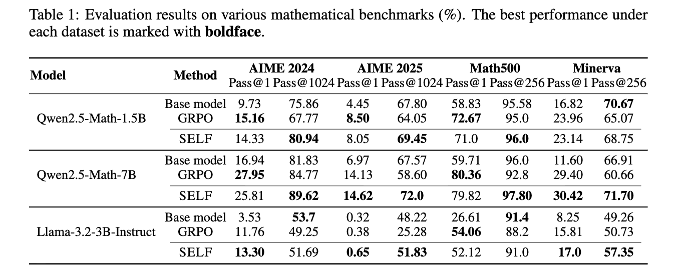

## The Reasoning Boundary Paradox: How Reinforcement Learning Constrains Language Models (2025) -- Offcial Implementation

**Abstract**: *Reinforcement Learning with Verifiable Rewards (RLVR) has emerged as a key method for improving Large Language Models' reasoning capabilities, yet recent evidence suggests it may paradoxically shrink the reasoning boundary rather than expand it. This paper investigates this shrinkage issue of RLVR by analyzing its learning dynamics and reveals two critical phenomena that explain this failure. First, we expose the negative interference phenomenon in RLVR, where learning to solve certain training problems actively reduces the likelihood of correct solutions for others, leading to the decline of Pass@$k$ performance or the probability of generating a correct solution within $k$ attempts. Second, we uncover the winner-take-all effect: RLVR disproportionately reinforces problems with high likelihood under the base model while suppressing initially low-likelihood, correct solutions. Through extensive theoretical and empirical analysis on multiple mathematical reasoning benchmarks, we show that this effect arises from the inherent on-policy sampling in standard RL objectives, causing the model to converge toward narrow solution strategies. Based on these insights, we propose a simple yet effective data curation algorithm that focuses RLVR learning on low-likelihood problems, achieving notable improvement in Pass@$k$ performance.*

### Highlights
* RLVR reduces the set of problems the model can solve, compared to the base model (decreased Pass@$k$) -- **the coverage shrinkage problem**.
* This is due to:
  * **Negative Interference** -- learning to solve some problems in a training batch reduces the likelihood of generating correct solutions for others outside of that training batch
  * **On-policy Learning**, which tends to reinforce problems highly solvable under the base model while neglecting problems with initially low likelihood of correct solutions. Negative interference makes this worse, leading to **winner-take-all** situation.
* SELF mitigates this coverage shrinkage by learning to solve only problems with low likelihood of generating correct solutions.
* SELF **significantly improves over GRPO** as $k$ increases, and as the size of the model grows (see below, more in the paper). 
    
    

### Installation
```bash
# Recommend Python 3.10.
pip install -r requirements.txt
pip install vllm==0.8.5.post1
cd verl
pip install -e .
```

### Data
Our raw training data in `deepscaler/data/[train|test]`, along with preprocessing scripts. To convert the raw data into Parquet files for training, run:
```python
# Output parquet files in data/*.parquet.
python scripts/data/deepscaler_dataset.py
```
To preprocess AIME25, run:
```python
python scripts/data/aime25.py
```
### Training Scripts

We provide training scripts for both single-node setup in `slurm`.
For GRPO Training:
```python
bash slurm/train_grpo.sh
```
For SELF Training:
```python
bash slurm/train_max_ppo.sh
```
### Evaluation Scripts
```python
bash slurm/eval.sh
```

### Citations

Please cite the following work when using this repository:

```
@article{nguyen2025self,
  title={The Reasoning Boundary Paradox: How Reinforcement Learning Constrains Language Models},
  author={Nguyen, Phuc M and La, Chinh D and Nguyen, Duy MH and Chawla, Nitesh V and Nguyen, Binh T.Nguyen and Doan, Khoa D}
  journal={arXiv preprint arXiv:2510.02230}
  year={2025}
}
```